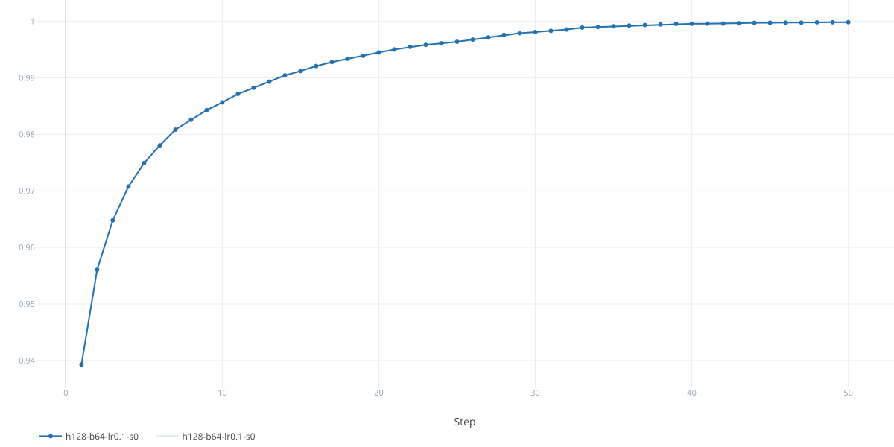
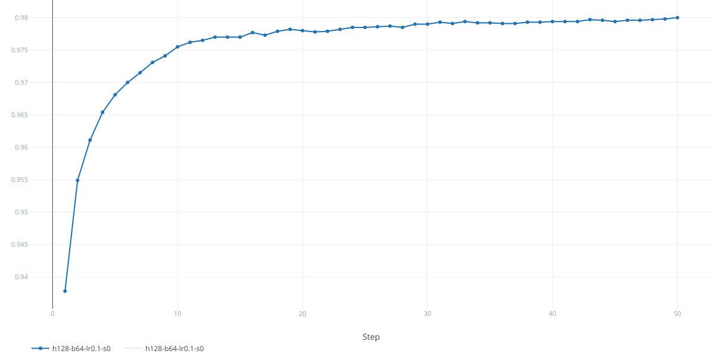

# Neural Networks from Scratch

A reverse-mode automatic differentiation engine and a feedforward neural
network, built on numpy's arithmetic and nothing else. No PyTorch, no autograd,
no `nn.Module` — the computational graph, the backward pass, the operators and
their gradients are all implemented here. Nothing under `src/` imports anything
but numpy, except `src/onnx/`, which exists to talk to the outside world.

Accompanies chapter 1 of *12 Machine Learning Projects*.

It trains MNIST to ~96% test accuracy in three epochs, and ~98% given fifty:

```
epoch   1  train 0.2194/0.9393  test 0.2149/0.9378  gap 0.0015
epoch   2  train 0.1577/0.9560  test 0.1596/0.9549  gap 0.0011
epoch   3  train 0.1250/0.9648  test 0.1317/0.9611  gap 0.0037
```

## Results

Fifty epochs with the default hyperparameters — one hidden layer of 128 units,
batches of 64, SGD at 0.1:

```bash
poetry run python -m experiments.train_test_ffnn --epochs 50
```

| training accuracy | test accuracy |
|---|---|
|  |  |

Training accuracy reaches **0.99987** and test accuracy **0.980**, flattening
out well before the end.

### Why that looks too good to be true

A test curve that only ever climbs, over fifty epochs, looks like a measurement
error. It isn't — every published MNIST curve for this architecture has the same
shape, and matching it is itself weak evidence the gradients are right. Three
things are going on.

**The overfitting is there; it just never costs a prediction.** The
generalisation gap widens from 0.1% at epoch 2 to 2.0% by epoch 30, and test
*loss* turns upward somewhere around epoch 25 while training loss keeps falling.
Accuracy only cares about which logit is largest, so a model growing more
confidently wrong about examples it already got wrong raises the loss without
flipping any predictions. Loss is the earlier and more sensitive signal.

**Capacity is not the binding constraint.** Widening the hidden layer from 128
to 1024 units — eight times the parameters — moves the gap from 0.0165 to
0.0170. Essentially nothing. The folk explanation that overfitting comes from
having too many parameters does not survive contact with this experiment—MNIST
may simply be too "clean".

**Clean MNIST has almost nothing harmful to memorise.** Its training set is
nearly perfectly consistent with its test set, so fitting it harder mostly
helps.

## What's in it

| module | what it does |
|---|---|
| `src/dag.py` | the computational graph: topological sort, the backward pass, gradient accumulation |
| `src/tensor.py` | the user-facing `Tensor`, its operators and its gradients |
| `src/operators/` | one class per operation, each with a `forward` and a vector-Jacobian product |
| `src/broadcasting.py` | reduces an adjoint back to its operand's shape — the adjoint of a broadcast is a sum |
| `src/ffnn/` | the network, the optimiser, the loss, and the MNIST loader |
| `src/onnx/` | export to ONNX: one mapping entry per operator, and a walk of the graph |
| `experiments/` | runnable experiments; the only place that depends on MLflow or click |
| `tests/helpers/finite_difference/` | numerical gradients, used to check every analytic one |

## Running it

```bash
poetry install
poetry run python -m experiments.train_test_ffnn --help
```

```
Options:
  --epochs INTEGER         Number of passes over the training set
  --batch-size INTEGER     Samples per gradient step
  --hidden-size INTEGER    Width of the hidden layer
  --learning-rate FLOAT    SGD step size
  --seed INTEGER           Seeds initialisation and shuffling
```

MNIST downloads on first run and caches under `data/`. A full run with the
defaults:

```bash
poetry run python -m experiments.train_test_ffnn --epochs 10
```

## ONNX

A trained model exports to ONNX, so the graph built here can be run by
something that has never heard of this codebase:

```python
model = Mlp(784, 128, 10, rng)
# ... train ...
proto = model.export(Tensor(features[:1], requires_grad=False))
```

Export needs an example input because the graph is built by tracing: nothing
exists until a forward pass has run. That is the same reason
`torch.onnx.export` asks for one.

The interesting part is that **every leaf of the graph is one of three things,
and nothing in the graph says which**:

| leaf | becomes | why |
|---|---|---|
| the features | `graph.input` | a name, a dtype and a shape — no data |
| a weight | `graph.initializer` | an input whose value travels inside the file |
| a constant in an expression | a `Constant` node | so an import can tell it from a weight and leave it untrained |

That third row is why `Model.parameters()` is what unblocks the export: ONNX has
no "trainable" flag, so "initializer" means weight only by convention. If the
weights were exported as inputs the file would contain no weights at all —
an architecture with the training thrown away.

One operator is not one-for-one. `UnaryPow` keeps its exponent as operator
state, and ONNX keeps no values outside tensors, so it emits a `Constant`
feeding an ordinary two-input `Pow`.

## Experiment tracking

Each run logs its hyperparameters and per-epoch metrics to MLflow. To browse
them:

```bash
poetry run mlflow ui
```

Then open `http://localhost:5000`.

No tracking server or configuration is needed. MLflow 3 defaults to a local
SQLite file, `mlflow.db`, and `mlflow ui` reads the same default — so both the
script and the UI find each other as long as you run them from the repo root.
`mlflow.db` is gitignored; the point is comparing runs on your own machine, not
shipping them.

## Checks

Everything runs through `tox`:

```bash
tox              # tests, lint, formatting, type checks
tox -e py313     # pytest only
tox -e lint      # flake8
tox -e format    # black, isort, autoflake, all in --check mode
tox -e typecheck # mypy over src, tests and experiments
```

GitHub Actions runs the same four environments on every pull request
(`.github/workflows/pr-checks.yml`), tests on both Linux and macOS.

### How the gradients are tested

Hand-derived gradients are easy to get subtly wrong — a transposed operand
produces plausible numbers rather than an error. So every operator's backward
pass is checked against a **numerical** estimate.

`approx_vjp` seeds the output with a random covector `v` and finite-differences
the resulting scalar. The gradient of `⟨v, f(x)⟩` is exactly `vᵀJ`, which is
what a backward pass computes — so the two can be compared without ever forming
the Jacobian, at a cost linear in the input size.

The other tests worth knowing about pin properties rather than values: that an
adjoint always has the shape of its value, that `unbroadcast` only ever
redistributes adjoint mass and never creates or destroys it, and that each row
of the cross-entropy gradient sums to zero.

## On the use of AI

This project was built with AI assistance (Claude).

**Written by hand, with AI used only to review:** the computational graph and
its topological sort, the backward pass, gradient accumulation, the
`requires_grad` propagation, the operator interface, `ReLU`, the optimiser, and
the fused softmax cross-entropy loss. The derivations behind them — the vector-Jacobian
product for matrix multiplication, why a broadcast's adjoint is a sum, why reverse
topological order is what makes accumulation correct — were worked through on paper
before any code was written.

**Written by AI, to a specification I set and under review:** `unbroadcast`, `Sum`,
the numerical-gradient helper, the straightforward floats -> numpy migration, most of
the test suite, and the MNIST loader.

Essentially, the engine is the part worth understanding, so it is the part I wrote. The
plumbing is the part I delegated.
